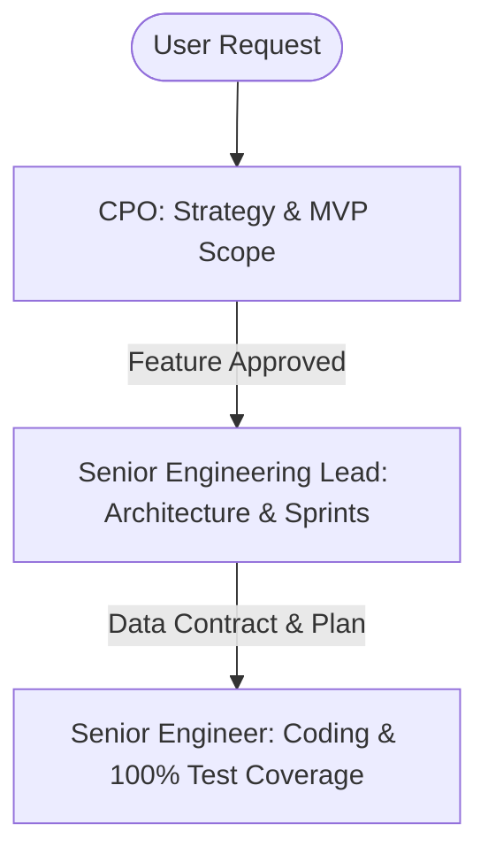

# Gravix Specialized Agent Team

Three custom Claude Code subagents and Antigravity profiles that own focused slices of Gravix's product lifecycle and implementation.

This file serves as the team manual: roster, dispatch guide, handoff matrix, and sequential execution flow.

---

## Design Philosophy

Following our "low-cost, data-first" philosophy, we allocate AI engineering effort proportionally to the task complexity:
- **CPO**: Decides *what* is worth building based on value vs complexity cost.
- **Senior Engineering Lead**: Decides *how* it should be designed, creating data contracts and sprint roadmaps.
- **Senior Engineer**: Handles *execution*, writing clean, minimal, CGO-free Go code and achieving 100% test coverage.

---

## Roster

| Agent | Role | Focus | Tools | Prompt Trigger |
|---|---|---|---|---|
| **CPO** | Chief Product Officer | Strategy, MVP gaps, cost/complexity evaluations | Read, WebSearch | *"Act as the CPO. Given our current hardened pipeline..."* |
| **Senior Engineering Lead** | Tech Lead & Architect | Schemas, system invariants, sprint planning | Read, Write, Edit, Bash | *"Act as the Senior Engineering Lead. The CPO wants [Direction]..."* |
| **Senior Engineer** | Developer & Implementer | Clean Go implementation, Protobuf contracts, 100% unit tests | Read, Write, Edit, Bash | *"Act as the Senior Engineer. We are starting Sprint [X]..."* |

---

## Dispatch Guide by Product Lifecycle



---

## Handoff Matrix

When an agent encounters a concern outside its core responsibilities, route the work:

| Need / Discovery | Route to | Action |
|---|---|---|
| Scope creep, complex feature request, product direction | **CPO** | Reject or request CPO strategy alignment against `AGENTS.md` constraints. |
| DB schema changes, API contracts, new component wiring | **Senior Engineering Lead** | Draft the tech proposal and ask the Tech Lead to define the schema and invariants. |
| Code changes, compiling errors, unit test gaps | **Senior Engineer** | Provide the technical plan and ask the Senior Engineer to execute. |

---

## Dispatch Brief Template

Every subagent delegation should be structured cleanly:

```
Goal: <single sentence description>
Role: <CPO | Senior Engineering Lead | Senior Engineer>
Context:
  - Current Phase: <Phase #>
  - Related Code: <paths>
Exit Criteria:
  - <Exact verification conditions (e.g. tests pass, schema compiled)>
```

---

## Shared Discipline

Every agent adheres to the same core values:
1. **Store facts, not metrics** — facts are immutable and append-only.
2. **Metrics are derived and recomputable** — no in-place modifications.
3. **Keep it simple and local-first** — DuckDB, clean Go binaries, Docker Compose.
4. **No agents, no logs platform, no distributed tracing, no custom query language**.
