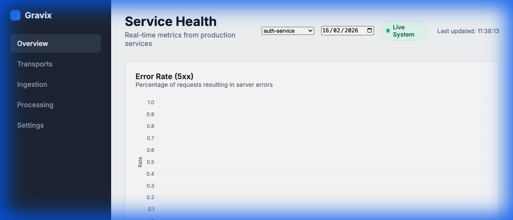

# Gravix

[](https://github.com/lgreene03/gravix-dashboards/actions/workflows/ci.yml)
[](LICENSE)
[](go.mod)
[](CONTRIBUTING.md#sign-your-commits-dco)

**Self-hosted HTTP service monitoring that can prove its own numbers.**

Gravix stores immutable request facts, derives metrics from them, and can rebuild any historical
window byte-for-byte from the facts it came from. Every metric it reports carries a published
contract saying how it was computed, how exact it is, and how it may be aggregated.

That last part is the point. Most monitoring tools will happily show you a "p95 over the last hour"
that is not a p95 — and will not tell you. Gravix either computes it correctly or says in writing
that it cannot.



## What Gravix is

A self-hosted tool for teams who need to know whether their HTTP services are healthy — latency
percentiles, error rates, throughput — without the cost and operational weight of a full
observability platform.

It stores **facts**, not metrics. Every number it shows is derived from immutable raw events and can
be recomputed from them.

## What Gravix is not

- No distributed tracing
- No log aggregation or search
- No agents or host-level daemons, and no infrastructure metrics
- No sub-minute dashboards or streaming query engines
- No high-cardinality dimensions (`user_id`, `request_id`, `session_id`, `ip_address`)
- No custom query language
- No feature parity with Datadog or New Relic

**These are permanent. They are in our constitution, not our backlog.**

If you need one of them, we will point you at a tool that does it well. See
[`docs/04-non-goals.md`](docs/04-non-goals.md).

## How it proves its numbers

Four mechanisms, each enforced by a test rather than a promise:

**Recomputability.** `gravix recompute --from 2026-09-01 --to 2026-09-08` rebuilds any window from
raw facts. Output is byte-identical to the original for the same facts, so re-running is a verifiable
no-op rather than a hopeful one. Rows are sorted on the full aggregation key, the compression level is
pinned rather than inherited, and nothing run-scoped — no timestamp, hostname or run id — reaches the
file.

**Provenance.** Every derived file has a manifest beside it recording its idempotency key, a content
digest over its rows, and every raw fact object it was built from. You can tell whether two files
describe the same window, and whether the contents changed, without reading either.

**Published metric contracts.** [`contracts/`](contracts/) defines each metric's formula, inputs,
grain, exactness, error bound and mergeability. A metric that is approximate **must** name its
defect, and a sketch **must** state its error bound, or the registry fails to load. That is the
mechanical definition of "no undisclosed approximations".
[`docs/02-derived-metrics.md`](docs/02-derived-metrics.md) is generated from those contracts, so the
published definition cannot drift from the code.

**Correct percentiles across time.** Combining per-bucket percentiles is the standard shortcut and it
is wrong. Taking the maximum of sixty one-minute p95s is not the hour's p95; on a heavy-tailed latency
distribution it is off by **62%**. Gravix stores a mergeable t-digest per bucket, so a window's
percentile is computed by merging sketches instead.

| Latency distribution | max of per-minute p95 | merged sketch |
|---|---|---|
| pareto | **62.4%** off | 0.295% |
| lognormal | **31.0%** off | 0.150% |
| normal | 3.4% off | 0.003% |
| uniform | 2.4% off | 0.007% |
| bimodal | 1.5% off | 0.001% |

Measured over 1,000,000 observations split into 1,440 one-minute buckets, by
`pkg/sketch.TestSketchBeatsMaxOfPercentiles`. Run it yourself:

```bash
go test ./pkg/sketch/ -run TestSketchBeatsMaxOfPercentiles -v
```

**And the qualification that belongs with it.** Those figures are for a window holding a million
observations. A t-digest guarantees accuracy of *rank*, not of *value*, and on a heavy tail one
observation of rank error at q=0.99 is an order of magnitude in value — so the value error depends on
how much data the window holds:

| observations in the window | worst relative value error |
|---|---|
| 100 | 446% |
| 1,000 | 17% |
| 10,000 | 5.8% |
| 100,000 | 0.8% |

The rank bound — the answer sits within 1% of the requested quantile's true rank — holds at every size.
Below roughly ten thousand observations, treat the value as indicative. `GET /api/v1/percentile` says
which regime your query is in, in the response.

This qualification is here because Gravix published the flat figure first and the correctness suite
caught it: [CD-001](docs/oss/correctness-defects.md). A register of the times our numbers did not check
out is the argument working, not an embarrassment — and it is the concrete reason to move to a
relative-error sketch, which is [already on the list](docs/oss/30-technology-review.md).

```bash
go test ./tests/correctness/ -run TestSketchErrorIsAFunctionOfSampleSize -v
```

**Or skip the reading and run the proof.** `./scripts/prove_it.sh` generates a week of data, adds
p99.9 and a new dimension to it *after the fact*, and checks both against computing them from
scratch. Ten seconds, no Docker, no account — and it tells you what it does not prove as plainly as
what it does. See [docs-site/docs/prove-it.md](docs-site/docs/prove-it.md).

## Everything below is free forever, under Apache-2.0

| Area | What you get |
|---|---|
| Ingestion | HTTP and OTLP-subset ingest, fsync durability, DLQ, all SDKs |
| Schemas | Protobuf contracts, validation, cardinality budget enforcement |
| Storage | Local disk, S3/MinIO, Parquet, compaction, retention, tiering |
| Compute | Rollup jobs, percentiles, error rates |
| Query | DuckDB and Trino engines, Cube semantic layer, SQL access, public metrics API |
| Visualise | Dashboard, custom saved dashboards |
| Alert | Threshold and statistical-deviation rules; Slack, webhook, PagerDuty, OpsGenie |
| Operate | Helm chart, docker-compose, `gravix` CLI, backup and restore |
| Secure | TLS, API keys, RBAC, audit log, 2FA, rate limiting |
| Automate | Terraform provider, GitHub Action, all public APIs |

**RBAC, audit logging, 2FA, TLS, unlimited retention, unlimited services and unlimited seats are
free. Charging for the ability to not be breached is the pattern our charter exists to prevent.**

Unlimited means unlimited. There is no seat count, no service cap, no retention limit, and no
ingestion throttle in the core — and adding one would violate
[the charter](docs/oss/00-open-core-charter.md) §7.4.

## What costs money

Gravix has a paid tier for organisations that run it *for other people*. Code for it lives in
[`ee/`](ee/), is source-available under BUSL-1.1, and converts to Apache-2.0 two years after each
release.

| Area | What it solves |
|---|---|
| Multi-tenancy | Running Gravix for other people |
| Billing and metering | Charging those people |
| SAML and SCIM | Many identity providers *(single-org OIDC stays free)* |
| Fleet management | Many installations |
| Compliance streaming | Many auditors *(the local audit log stays free)* |
| White-label | Reselling |

**The core builds, tests and runs with `ee/` deleted. CI proves this on every pull request.**

None of the paid features exist yet. They are Phase 13. See
[`docs/oss/20-roadmap-horizon-2.md`](docs/oss/20-roadmap-horizon-2.md).

## Quick start

### Prerequisites

- Docker and Docker Compose
- Go 1.24+ for local development and tests

### 1. Configure

```bash
cp .env.example .env
# Edit .env — at minimum, change the API_KEY and MINIO_ROOT_PASSWORD
# Set CUBEJS_API_SECRET to enable dashboard authentication
```

### 2. Start

```bash
docker-compose up -d --build
```

This starts ingestion, MinIO, Trino, Cube.js, the dashboard, Prometheus, Grafana, and the rollup and
purge jobs. The load generator sends synthetic traffic automatically; metrics appear after the first
rollup cycle, about five minutes.

For a leaner stack (~800 MB rather than ~7.8 GB), use the bootstrap compose file. It needs no
configuration at all — no `.env` to copy, no API key to paste:

```bash
docker compose -f docker-compose.bootstrap.yml up -d --build
```

On first boot it creates a local tenant, generates an API key into `data/api_key.txt`, writes the
dashboard's settings, and starts sending synthetic traffic so the charts have something to show.
To stop the synthetic traffic:

```bash
docker compose -f docker-compose.bootstrap.yml stop synthetic-traffic
```

### 3. View the dashboard

Open [http://localhost:8000/index.html](http://localhost:8000/index.html).

If `CUBEJS_API_SECRET` is set, you will be prompted for a password.

### 4. Send your own data

```bash
curl -X POST http://localhost:8090/api/v1/facts \
  -H "X-API-Key: $(grep API_KEY .env | cut -d= -f2)" \
  -H "Content-Type: application/json" \
  -d '{
    "eventId": "'$(uuidgen | tr '[:upper:]' '[:lower:]')'",
    "eventTime": "'$(date -u +%Y-%m-%dT%H:%M:%SZ)'",
    "service": "my-api",
    "method": "GET",
    "pathTemplate": "/api/health",
    "statusCode": 200,
    "latencyMs": 42
  }'
```

Or use the built-in load generator:

```bash
go run ./cmd/load_generator/ --api-key "$(grep API_KEY .env | cut -d= -f2)"
```

## Local service endpoints

| Service | URL |
|---------|-----|
| Dashboard | http://localhost:8000/index.html |
| Ingestion API | http://localhost:8090/api/v1/facts |
| Gateway API | http://localhost:8091 |
| Trino UI | http://localhost:8081 |
| Cube Playground | http://localhost:4000 |
| Prometheus | http://localhost:9090 |
| Grafana | http://localhost:3000 |
| MinIO Console | http://localhost:9001 |

## Architecture

```
Load Generator → Ingestion (HTTP/JSONL) → Local Disk / S3 (MinIO)
                                             ↓
                                    Rollup ETL Job (Go)
                                             ↓
                               Parquet files in data/warehouse/
                                             ↓
                                  Trino (SQL query engine)
                                             ↓
                                   Cube.js (semantic layer)
                                             ↓
                                   Dashboard (static HTML/JS)
```

Facts are immutable and append-only. Metrics are derived and disposable — if the definition changes,
they are recomputed from the facts. See [`docs/00-system-truth.md`](docs/00-system-truth.md).

Two deliberate choices worth naming, because both look like omissions:

- **The dashboard is plain HTML, CSS and JavaScript with no build step.** For a tool whose argument is
  that you can verify what it shows you, putting a 200-dependency build pipeline in front of the UI
  would undercut the product. Three static files can be served by anything and audited by anyone.
- **No HTTP framework.** Since Go 1.22 the standard library router handles method and path patterns,
  so the services use `net/http` directly. Zero web-framework dependencies in the request path.

Where the stack is *not* currently the right choice — and it is not, in places — that is written down
honestly in [`docs/oss/30-technology-review.md`](docs/oss/30-technology-review.md) rather than left
for you to discover.

## Development

```bash
make build             # Build all Go binaries to bin/
make test              # Run all tests with verbose output and coverage
make up                # docker-compose up -d --build
make down              # docker-compose down
make clean             # Remove binaries and tear down volumes
make lint              # go vet ./...
make purge             # Run data retention purge (30 days)
make trino-init        # Initialize Trino schemas

make check-boundary    # Enforce the open-core boundary
make build-oss         # Build the core with ee/ deleted
make test-oss          # Build and test the core with ee/ deleted
make verify-reproducible  # Build every binary twice, compare digests

make contracts         # Regenerate docs/02-derived-metrics.md from contracts/
make contracts-check   # Fail if that generated doc is stale
```

Binaries build into `bin/`. Note that `go build ./cmd/foo` with no `-o` writes the binary into the
working directory — `.gitignore` covers every command by name, because that is how three compiled
binaries once ended up committed to this repository.

### Running tests

```bash
# All tests
go test ./... -v -cover

# Schema validation tests only — held at 100% coverage
go test ./schemas/... -v -cover

# Ingestion handler tests
go test ./services/ingestion/... -v

# Rollup aggregation tests
go test ./transforms/request_metrics_minute/... -v

# Storage tests (includes path traversal checks)
go test ./pkg/storage/... -v
```

Without Docker, the golden-path smoke test exercises the pipeline end to end:

```bash
./scripts/golden_path_test.sh
```

## Verify what you are running

Releases are signed with keyless cosign and their builds are reproducible.

```bash
make verify-reproducible
```

```bash
cosign verify-blob \
  --certificate-identity-regexp 'https://github.com/lgreene03/gravix-dashboards/.*' \
  --certificate-oidc-issuer https://token.actions.githubusercontent.com \
  --certificate <file>.pem --signature <file>.sig <file>
```

Full instructions: [`docs/verifying-releases.md`](docs/verifying-releases.md).

## Documentation

| Topic | Where |
|---|---|
| System invariants | [`docs/00-system-truth.md`](docs/00-system-truth.md) |
| What we will not build | [`docs/04-non-goals.md`](docs/04-non-goals.md) |
| Architecture | [`docs/architecture.md`](docs/architecture.md) |
| Deployment | [`docs/deployment-guide.md`](docs/deployment-guide.md) |
| API reference | [`docs/07-api-reference.md`](docs/07-api-reference.md) |
| Operations — local (Docker Compose) | [`docs/06-operations.md`](docs/06-operations.md) |
| Operations — production (Kubernetes) | [`docs/operations.md`](docs/operations.md) |
| Upgrading | [`docs/upgrade-guide.md`](docs/upgrade-guide.md) |
| Metric definitions (generated) | [`docs/02-derived-metrics.md`](docs/02-derived-metrics.md) |
| Storage layout and manifests | [`docs/03-storage-layout.md`](docs/03-storage-layout.md) |
| Open-core charter | [`docs/oss/00-open-core-charter.md`](docs/oss/00-open-core-charter.md) |
| Current roadmap | [`docs/oss/20-roadmap-horizon-2.md`](docs/oss/20-roadmap-horizon-2.md) |
| Technology review — what to replace and why | [`docs/oss/30-technology-review.md`](docs/oss/30-technology-review.md) |
| Known spec defects | [`docs/oss/spec-defects.md`](docs/oss/spec-defects.md) |

## Contributing

See [`CONTRIBUTING.md`](CONTRIBUTING.md), [`GOVERNANCE.md`](GOVERNANCE.md) and
[`CODE_OF_CONDUCT.md`](CODE_OF_CONDUCT.md).

**Gravix uses the DCO. There is no CLA, and there will never be one — see
[`docs/oss/00-open-core-charter.md`](docs/oss/00-open-core-charter.md) §3 for why.**

Start with a [`good first issue`](https://github.com/lgreene03/gravix-dashboards/labels/good%20first%20issue).

## Licence

| Path | Licence |
|---|---|
| Everything except `ee/` | Apache-2.0 |
| `ee/**` | BUSL-1.1 — **source-available, not open source** — converting to Apache-2.0 after two years |
| `docs/**` | CC-BY-4.0 |

Full map: [`LICENSES.md`](LICENSES.md). Trademark policy: [`TRADEMARK.md`](TRADEMARK.md) — forks are
welcome; the name is reserved.

## Security

See [`SECURITY.md`](SECURITY.md).

**Please do not open a public issue for a vulnerability.** Use
[private vulnerability reporting](https://github.com/lgreene03/gravix-dashboards/security/advisories/new).
